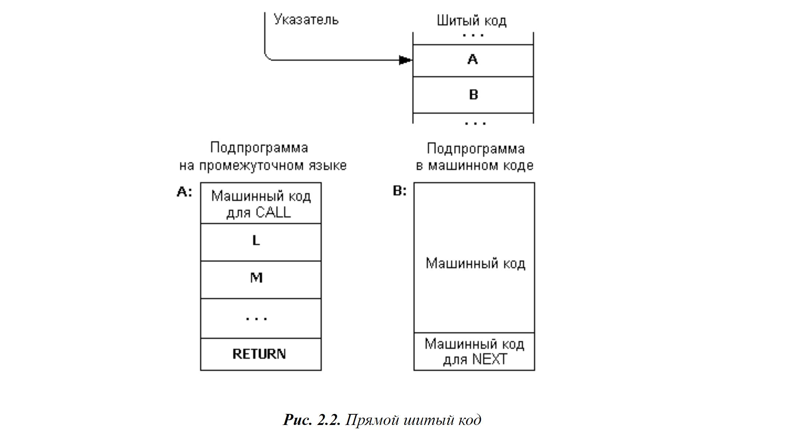
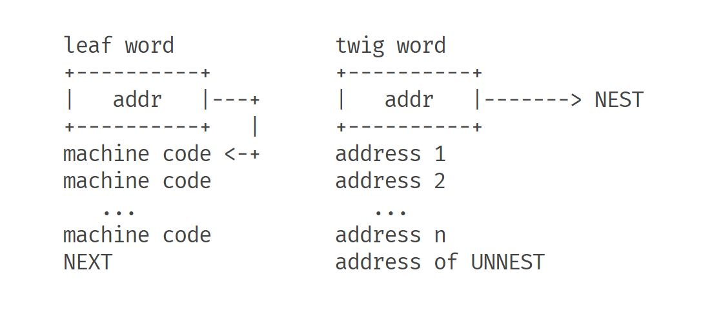
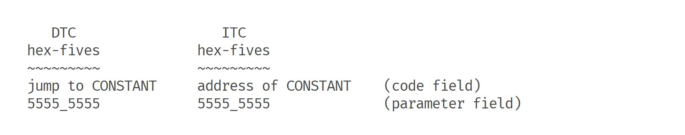

# Шитый код

## Виды реализации языков программирования

Логически можно выделить 2 способа преобразования исходного кода в исполняемую программу, то есть
в машинный код, который будет обработан процессором:

- Использование компилятора, который преобразует текст программы в машинный код
  конкретной ЭВМ. Компилятор читает всю программу целиком, после чего делает ее перевод. На выходе получается
  исполняемый
  файл, который, хоть и работает быстро, но проблема в том, что он платформно-зависимый, то есть является непереносимым.
- Использование интерпретатор. Интерпретатор исполняет программу, которая была написана на высокоуровневом
  языке, рассматривая исходную программу как последовательность опкодов, то есть кодов операций. Он не переводит
  весь код в машинный код, а построчно принимает команды и выполняет их.

Между трансляцией и интерпретацией находится большой спектр промежуточных вариантов. Люди придумали писать инструкции
для конкретной виртуальной машины, и использовать интерпретатор на каждой аппаратной архитектуре, чтобы расшифровать
эти инструкции. То есть необходимо скомпилировать только интерпретатор, который создает экземпляр среды виртуальной
машины и выполняет инструкции

## Определение шитого кода. Его предназначение

Теперь перейдем непосредственно к определению Шитого кода. Чтобы его корректно понять, необходимо разобрать
способы преобразования исходного кода в исполняемую программу.

Шитый код (Threaded code) - это техника исполнения программ, при которой исходный код программы не транслируется
непосредственно в машинный код, а вместо этого создается последовательность инструкций, называемых потоковыми
инструкциями или "шитыми" инструкциями. Эти инструкции затем исполняются интерпретатором или виртуальной машиной.

Применение шитого кода часто встречается в интерпретируемых языках программирования и в системах виртуальных машин,
таких как Java Virtual Machine (JVM). Он позволяет достичь некоторой степени портируемости программного обеспечения,
поскольку исполнение программы зависит от интерпретатора или виртуальной машины, которые могут быть реализованы на
различных аппаратных платформах. Кроме того, шитый код может обеспечивать простоту и гибкость.  
Отдельно хочется выделить то, что шитый код компактен, если его сравнивать с машинным кодом. Но это
преимущество дается не просто так - оно достигается путем некоторого замедления. Однако стоит заметить, что программа,
достаточно маленькая для того, чтобы полностью поместиться в оперативной памяти, будет работать быстрее, чем более
большая программа, использующая подкачку с жёсткого диска.

## Понимание шитого кода

Представим организацию программы таким образом, что она состоит из двух видов подпрограмм:

- Листовые подпрограммы, которые выполняют вычисления или операции ввода-вывода, но не делают вызовы другого кода
- Twig(ветка) подпрограммы, которые вызывают только другой код (который может быть подпрограммой как листовой, так и
  twig). Буду называть везде twig вместо ветки.

Так как наши подпрограммы twig состоят целиком из вызовов другого кода, то мы можем удалить коды операций вызова, тем
самым наш код начал представлять собой список адресов. Инструкцию возврата, которая завершает нашу исходную процедуру,
можно заменить адресом специальной процедуры выхода. Twig подпрограммы всегда завершаются адресом подпрограммы выхода,
что естественно является недостатком.

Так как мы удалили операции вызова(opcode) в подпрограммах ветки, а оставили лишь адреса, нам нужно начать разделять
листовые программы от twig программ. Для этого вводится заголовок, который сигнализирует процессору, что необходимо
запушить стек вызовов, чтобы потом успешно вернуться к twig подпрограмме. Но что именно мы помещаем в стек?
Для того чтобы это определить, необходимо понять, как именно мы интерпретируем список адресов, составляющих тело
twig подпрограммы.

Так как мы извлекаем и выполняем инструкции, необходим собственный счетчик программы, чтобы в текущей twig
подпрограмме сохранять указатель на следующую инструкцию. Будет называть этот указатель - IP.

Для того чтобы интерпретировать адрес twig подпрограммы, нам нужен фрагмент кода, который будет получать текущий
адрес инструкции, увеличивать IP и выполнять процедуру по тому адресу, который получил этот фрагмент кода. В
разных местах данный фрагмент кода может называться по-разному, но в Forth сообществе этот маленький фрагмент кода
называется NEXT. По факту его единственная работа - обработать следующий адрес в списке.

Вернемся к вопросу про то, что помещается в стек. Заголовок помогает нам разделить ip новой twig подпрограммы от старой,
таким образом прежде чем настроить ip так, чтобы он указывал на первый адрес в вызываемой twig процедуре, мы должны
поместить прошлый ip в стек. Такой заголовок называется NEST либо DOCOLON. Специальная же процедура выхода из каждой
подпрограммы twig называется UNNEST либо EXIT. Она берет адрес из стека и вызывает на нем NEXT.

Каждая листовая операция заканчивается не инструкцией возврата, а операцией NEXT. NEST и UNNEST также заканчиваются
операциями NEXT. Получается, что все операции заканчиваются операциями NEXT.

Таким образом, можно подвести итог, что для Шитого Кода нужно 3 управляющие операции -

NEXT:

- Получить адрес, на который указывает IP.
- Увеличение IP по размеру адреса
- Перейти к полученному адресу

NEST:

- Вставить IP в стек вызовов
- Установить IP так, чтобы он указывал на первый адрес вызываемой процедуры ветки
- Выполнить NEXT

UNNEST:

- Извлечь IP из стека вызовов
- Выполнить NEXT

## Виды Шитого Кода

### Прямой шитый код (Direct threading)

Алгоритм, который был описан в "Понимание Шитого Кода", по факту и является реализацией прямого шитого кода (DTC -
Direct-Threaded code), поскольку NEXT переходит непосредственно к адресу, полученному из списка адресов, составляющих
тело процедуры twig  

Для того чтобы понять следующий вид шитого кода, необходимо разобраться в том, как же NEST вычисляет новый IP. Есть два
способа:

1) Первый не очень очевидный - извлечь стек вызовов(машины). Всплывающий адрес будет адресом первого адреса в
   подпрограмме(Это семантика любой инструкции вызова - поместить следующий адрес в стек вызовов машины, а затем перейти
   к
   месту назначения. Мы намеренно неправильно используем эту семантику, чтобы положить адрес сразу за NEST).
2) Но есть и другой способ, который зачастую является более эффективным. Мы можем использовать другой регистр-указатель,
   который часто называется W (от слова "word"), для использования таких инструкций как NEXT и NEST.

Тогда получается, что

NEXT:

- Получить в W адрес, на который указывает IP.
- Увеличить IP по размеру адреса
- Перейти к W

NEST:

- вставить IP в стек вызовов
- Установить IP на W + sizeof (переход)
- Выполнить NEXT

Теперь «call NEST» заменен на «jump NEST» в заголовке процедуры ветки. Поскольку W указывает на заголовок, то,
смещая его (на размер инструкции перехода), мы можем вычислить адрес первого адреса в списке,
непосредственно за переходом на NEST. Устанавливаем IP на этот адрес.
То есть наши листовые и twig подпрограммы сейчас выглядят так:

Листовые

```forth
machine code
machine code
...
machine code
NEXT
```

twig

```forth
jump NEST
address 1
address 2
...
address n
address of UNNEST
```

Когда NEXT выполняет листовое слово, «Jump к W» переходит непосредственно к машинному коду. Но когда он выполняет
twig команду, он выполняет jump к jump. Естественно это плохо для производительности, так что придумали другой
вид шитого кода

### Косвенно-шитый код (Indirect threading code)

Заменив инструкцию jump NEST (или call NEST) в начале каждого слова ветки указателем на NEST и добавив косвенное
направление к NEXT:
NEXT:

- Получите в W адрес, на который указывает IP.
- Увеличение IP по размеру адреса
- Получить в X адрес, на который указывает W
- Перейти к X

и изменив немного NEST на

- Вставить IP в стек вызовов
- Установите IP на W + размер адреса
- Выполнить NEXT

Мы получаем код ITC, то есть косвенно-шитый код. DTC является прямым, потому что NEXT переходит непосредственно к
адресу,
выбранному из списка адресов в теле twig  
ITC же является косвенным, потому что NEXT косвенно переходит по адресу, полученному из списка адресов, составляющих
тело процедуры twig. Кроме того, стоит заметить, что в DTC начало подпрограмм как листовых, так и twig, начинались с
машинного кода; в ITC же начинается с указателя на машинный к2од.


## Каждая строчка кода - исполняема

Для начала введу небольшую терминологию:

- слова из листовой подпрограммы называются кодовыми словами
- слова из twig подпрограммы называются словами-двоеточиями.
- Адрес поля кода сокращенно - cfa
- Адрес поля параметра - pfa

Конечно кодовые слова и слова-двоеточия - не единственные виды слов в многопоточной кодовой системе. Не стоит
забывать про данные. Приведу в пример два распространенных типов данных Forth: переменные и константы. Хотя, вероятно,
существуют и другие подходы, в Forth все в системе, включая типы данных – имеет исполняемое поведение.

Что может означать выполнение переменной или константы? Начнем с констант, поскольку они проще. Константа помещает свое
значение в стек данных. Это все, то она делает.

CONSTANT:

- Добавить к W размер поля кода (Вычислить адрес поля параметра)
- Извлечь значение, на которое указывает W, в W (извлечь содержимое)
- Вставить W в стек данных
- Выполнить NEXT

Перейдем к переменной. Она помещает адрес своего значения в стек данных. Код, который выполняют все переменные, очень
похож на CONSTANT. Если CONSTANT помещает значение, хранящееся в поле параметра, VARIABLE помещает адрес поля параметра,
то есть pfa.

VARIABLE:

- Добавить к W размер поля кода(Вычислить PFA)
- Вставить W в стек данных (вставить pfa)
- Выполнить NEXT

## Преимущества и недостатки Шитого кода

### Преимущества

В первую очередь стоит заметить, что шитый код - простой и единообразие. Его легко читать, понимать и расшифровывать.
Кроме того из-за его специфики он получается весьма плотным.  
Довольно легко запустить реализацию шитого кода в новой архитектуре, и после запуска инструменты высокого
уровня, написанные для совершенно другой архитектуры, скорее всего, будут работать без изменений или с очень небольшими
изменениями. Структурная однородность позволяет очень легко расширять и модифицировать без изменения базовой реализации.
Я могу добавлять новые структуры данных и новые структуры управления по своему желанию, не изменяя базовый компилятор.
Поскольку мы не можем встроить код, все становится отдельным словом. Это имеет интересный побочный эффект: оно
агрессивно удаляет избыточность из программ, которые имеют тенденцию становиться намного меньше. Иногда многопоточная
обработка выполняется быстрее, чем собственный код. В машинном коде вызов подпрограммы требует эквивалента двух
переходов: вызова и возврата. На конвейерных машинах это может занять несколько циклов.

### Недостатки

Скорость, а иногда и размер. Поскольку мы теряем возможность встраивания любого вида кода, даже простые вещи, такие
как «сложить эти два числа», приходится писать как отдельные процедуры и «вызывать» через NEXT. Это явно медленнее,
чем встраивание. С точки зрения размера, на процессорах, где инструкция меньше адреса (например, на 32-битных машинах
с 16-битными инструкциями), собственный код иногда может быть более плотным, но обычно «дедупликация», которую поощряет
многопоточность, компенсирует это.

## Вывод

Поточный код — чрезвычайно простой и элегантный способ реализации языковых интерпретаторов. По сравнению с
интерпретаторами с байт-кодом он довольно быстр, а компиляторы для него по сути тривиальны. Поскольку он создает
систему, полностью состоящую из однородных частей, расширяемость системы пользователями практически не ограничена,
а создание универсальных инструментов значительно упрощается. Но всё это достигается в основном за счет увеличения
времени выполнения программы

## Ссылки

[muforth.dev](https://muforth.dev/threaded-code/)  
[ru.wikipedia.org](https://ru.wikipedia.org/wiki/%D0%A8%D0%B8%D1%82%D1%8B%D0%B9_%D0%BA%D0%BE%D0%B4)  
[en.wikipedia.org](https://en.wikipedia.org/wiki/Threaded_code)
